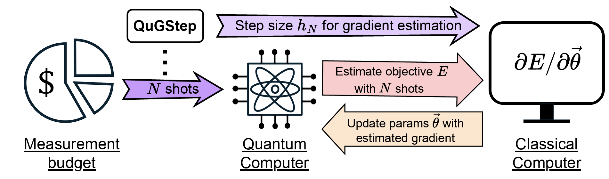

# QuGStep for Variational Quantum Algorithms


By [Senwei Liang](https://leungsamwai.github.io) <sup>1†</sup>, [Linghua Zhu](https://scholar.google.com/citations?user=BNPyHf4AAAAJ&hl=en) <sup>1†</sup>, Xiaosong Li and Chao Yang

This repo is the implementation of "QuGStep: Refining Step Size Selection in Gradient Estimation for Variational Quantum Algorithms" [[paper]](https://arxiv.org/abs/2503.14366).

## Introduction

Variational quantum algorithms combine quantum circuits with classical optimization to tackle complex problems but are hindered by noise from limited measurement shots. Gradient estimation via finite differences is particularly sensitive to the step size used, with poor choices amplifying noise and degrading optimization. **QuGStep** is an algorithm that determines the optimal step size for finite-difference gradients under a shot budget. 



## Environment
* Qskit

## Code structure

```
QuGStep
│   README.md    <-- You are here
│
└─── BeH2   
│   │   BeH2_36d.py
│   
└─── QuGstep.png
```

## How to run

* Run
```

```
* BeH2 experiment. `--shots`: number of shots `--eps`: finite difference step size `--init`: constant initialization `--trial`: trial index; 
```
python BeH2_36d.py --shots 600 --eps 0.001 --init 1.5 --trial 1
```
## Citing QuGStep
If you find the code in this repo is helpful for your research, please kindly cite
```
@article{liang2025qugstep,
  title={QuGStep: Refining Step Size Selection in Gradient Estimation for Variational Quantum Algorithms},
  author={Liang, Senwei and Zhu, Linghua and Li, Xiaosong and Yang, Chao},
  journal={arXiv preprint arXiv:2503.14366},
  year={2025}
}
```
